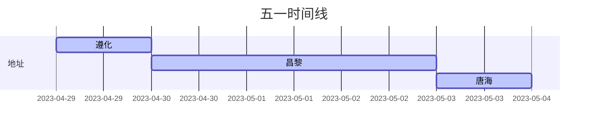

时间：2023年4月29日-5月3日

地区：北京->昌黎->葫芦岛->锦州

**昌黎（第1天早出发，住2晚）**

* 黄金海岸
* 碣石山
* 秦皇**求仙**入海处？

**秦皇岛（第3天早出发，住一晚）**

- 山海关(5A)

**锦州（第4天早出发，住一晚）**

- 小烧烤

**盘锦（第5天早出发）**

- 红海滩（5A)

较多，大概率玩不完。

其他：

遵化（看起来一般PASS，八仙山、黄崖关长城、清东陵）

唐海（金沙岛、月坨岛、菩提岛）
